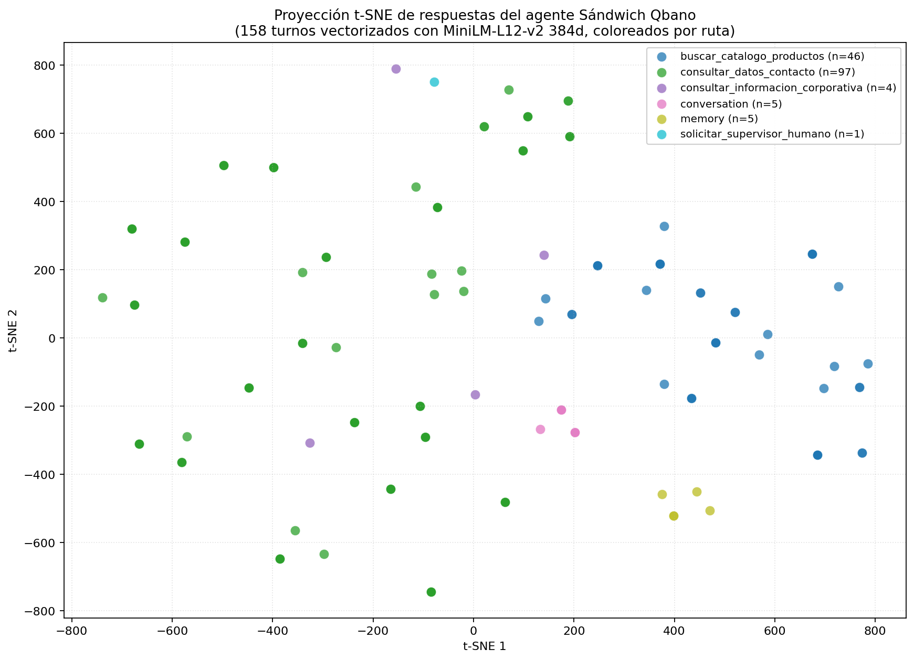

# 1. Problema y solución

## 1.1 La necesidad de la empresa

Sándwich Qbano es una cadena colombiana de comida rápida con más de **220 puntos de venta** en Colombia, presencia adicional en Panamá y Estados Unidos, y un volumen mensual conservador de **decenas de miles** de consultas vía sus canales digitales (sitio web, WhatsApp de servicio al cliente, redes sociales). La operación de soporte conversacional hoy depende de un equipo humano que responde por canales separados, sin memoria de la conversación entre canales, sin trazabilidad estructurada para auditar la calidad de la respuesta, y sin garantías de que la información entregada (precios, sedes, horarios) coincida con las fuentes oficiales de la marca.

La pregunta concreta que este sistema responde es:

> ¿Cómo le da una cadena de comida rápida con presencia nacional **atención conversacional 24/7 vía WhatsApp**, sin alucinaciones, sin contratar más agentes humanos, sin reescribir su sitio web, y manteniendo sus fuentes oficiales como única verdad?

## 1.2 La solución propuesta

Un agente conversacional empresarial que:

1. Ingiere el conocimiento público de la marca una sola vez (scraping del sitio + parsing del informe oficial de sostenibilidad 2023).
2. Lo consolida en dos capas complementarias: una base vectorial local con `ChromaDB` para preguntas abiertas, y un JSON estructurado con datos puntuales (WhatsApp, redes, sedes).
3. Atiende mensajes por dos canales independientes que comparten el mismo cerebro: la UI de Streamlit (para demostración y operación humana) y una API REST en `FastAPI` consumida por `n8n` desde el webhook de **Twilio Sandbox for WhatsApp**.
4. Toma decisiones de enrutamiento con un router determinístico antes de invocar al LLM, lo que reduce alucinaciones y minimiza el costo de tokens.
5. Persiste cada turno en `PostgreSQL` con `thread_id = número de teléfono del usuario`, lo que permite memoria conversacional real entre sesiones y auditoría completa de la atención.
6. Implementa un middleware de aprobación humana (`HumanInTheLoopMiddleware`) sobre una tool sensible que registra escalamientos a un supervisor real.

El sistema fue demostrado end-to-end el **4 de junio de 2026** desde un número de WhatsApp personal: el mensaje viajó desde el celular hasta Twilio, de allí al túnel ngrok, al workflow n8n, al endpoint `POST /chat` de FastAPI, al agente LangGraph que ejecutó la tool `consultar_datos_contacto`, y la respuesta volvió por el mismo camino al celular en menos de cinco segundos. Toda la trazabilidad quedó persistida en la tabla `conversation_messages` de PostgreSQL.

---

# 2. Evolución arquitectónica

El proyecto **no se rehizo en cada taller**. Cada taller añadió una capa que reutilizó la base anterior sin reescribirla. Esta decisión fue deliberada: garantizar que el agente del Taller 3 ejecutara exactamente el mismo `run_agent` que se validó en el Taller 2 redujo la superficie de bugs y mantuvo la suite de tests vigente entre módulos.

## 2.1 Línea de tiempo

| Taller | Capa añadida | Tecnologías nuevas | Tecnologías conservadas |
|--------|--------------|---------------------|--------------------------|
| **Taller 1** (Módulo 1) | Pipeline de conocimiento + Q&A clásico | Scraping HTML, parsing PDF, chunking ad-hoc, vector store custom (feature hashing + JSON), Streamlit | — |
| **Taller 2** (Módulo 2) | Agente conversacional con memoria + router + tool estructurada | ChromaDB, HuggingFace embeddings (`MiniLM-L12-v2`), `RecursiveCharacterTextSplitter`, JSON estructurado de datos puntuales, multi-LLM (Ollama / Gemini / OpenAI) | Scraping, Streamlit, prompts editables |
| **Taller 3** (Módulo 3, **Ruta A**) | Productización: API REST + canal real WhatsApp + memoria persistente + Function Calling estricto + HITL | FastAPI, Uvicorn, PostgresSaver de LangGraph, tabla custom `conversation_messages`, `create_agent` con tools Pydantic, `dynamic_prompt`, `HumanInTheLoopMiddleware`, n8n local en Docker, Twilio Sandbox, ngrok | Todo lo del Taller 2 |

## 2.2 Comparación visual

```
Taller 1                       Taller 2                       Taller 3 (Ruta A)
─────────                      ─────────                      ───────────────────
Streamlit (UI única)           Streamlit + chat history       Streamlit + FastAPI + WhatsApp
Q&A clásico                    Agente con router              create_agent + HumanInTheLoop
LangChain ChatPromptTemplate   ChatPromptTemplate +            init_chat_model + dynamic_prompt
                               structured tool                 + Pydantic tool schemas
Feature hashing + JSON         ChromaDB + HuggingFace          ChromaDB + HuggingFace
(custom, no LangChain native)  embeddings (LangChain native)   (sin cambios)
Memoria efímera                Memoria en st.session_state    PostgresSaver + tabla custom
(solo durante la sesión)                                       multi-LLM por sesión / por request
Una sola fuente: web           web + JSON estructurado         + memoria personal (nombres)
                               + 3 rutas determinísticas       + 4ª ruta sensible HITL
                                                               + workflow N8N + Twilio
```

## 2.3 Deuda técnica resuelta entre Taller 2 y Taller 3

Al cierre del Taller 2 se identificaron seis deudas técnicas que el Taller 3 resolvió:

1. **Multi-LLM solo configurable por `.env` y reinicio.** Resuelto en Fase 4.5: selector de proveedor y modelo en el sidebar de Streamlit y en el body de `POST /chat`, sin reinicio.
2. **Routing de "¿cómo me llamo?" se iba al RAG.** Resuelto en Fase 4.6: detector heurístico de preguntas de memoria personal con respuesta sintetizada por el LLM sobre el historial.
3. **Memoria efímera por sesión Streamlit.** Resuelto en Fase 4: `PostgresSaver` + tabla custom `conversation_messages` con `thread_id` por usuario.
4. **Sin canal externo de consumo.** Resuelto en Fase 5: API REST con OpenAPI auto-generado.
5. **Sin function calling estricto.** Resuelto en Fase 3.5: cuatro tools Pydantic + `HumanInTheLoopMiddleware` sobre tool sensible.
6. **`dynamic_prompt` ausente.** Resuelto en Fase 3.5: prompt del agente generado dinámicamente con contexto del modelo activo, fecha y tools disponibles.

---

# 3. Arquitectura end-to-end

## 3.1 Diagrama de despliegue

El sistema corre principalmente en local con dos componentes en la nube que solo actúan como capa de transporte (Twilio + ngrok). Esto garantiza que un fallo de internet o un corte en un servicio externo no afecte la operación interna del agente.

```
                         ┌─────────────────────────────────┐
                         │  Usuario WhatsApp (celular)      │
                         └──────────────┬──────────────────┘
                                        │ texto plano
                                        ▼
                         ┌─────────────────────────────────┐
                         │  Twilio Sandbox (+14155238886)   │
                         │  WhatsApp Business API gratis    │
                         └──────────────┬──────────────────┘
                                        │ POST form-urlencoded
                                        │ {From, To, Body, ...}
                                        ▼
                         ┌─────────────────────────────────┐
                         │  ngrok https://*.ngrok-free.dev  │
                         │  túnel TLS al localhost:5678     │
                         └──────────────┬──────────────────┘
                                        ▼
                         ┌─────────────────────────────────┐
                         │  n8n local (Docker qbano_n8n)    │
                         │  workflow whatsapp_qbano.json    │
                         │                                  │
                         │  [Webhook]                       │
                         │      ↓                           │
                         │  [Set: extraer From/Body]        │
                         │      ↓ json {thread_id, message} │
                         │  [HTTP POST host.docker          │
                         │   .internal:8000/chat]           │
                         │      ↓ json {answer, route}      │
                         │  [HTTP POST Twilio API]          │
                         │   (Basic Auth via credencial)    │
                         │      ↓                           │
                         │  [Respond <Response></Response>] │
                         └──────────────┬──────────────────┘
                                        │ HTTP POST /chat
                                        ▼
                         ┌─────────────────────────────────┐
                         │  FastAPI (uvicorn, puerto 8000)  │
                         │  api/main.py                     │
                         │                                  │
                         │  POST /chat → run_agent()        │
                         │  GET  /health                    │
                         │  GET  /info                      │
                         │  GET  /docs (Swagger UI)         │
                         └──────────────┬──────────────────┘
                                        │
                ┌───────────────────────┼───────────────────────┐
                ▼                       ▼                       ▼
   ┌─────────────────────┐  ┌─────────────────────┐  ┌─────────────────────┐
   │  ChromaDB (185 vec) │  │  JSON estructurado  │  │  PostgresSaver +    │
   │  data/vector/chroma │  │  43 registros       │  │  conversation_msgs  │
   │  Multilingual MiniLM│  │  contacto, sedes,   │  │  Postgres 16 Docker │
   │  L12-v2 (384 dim)   │  │  sostenibilidad     │  │  qbano_postgres     │
   └─────────────────────┘  └─────────────────────┘  └─────────────────────┘
                                        │
                                        │ paralelamente
                                        ▼
                         ┌─────────────────────────────────┐
                         │  Streamlit (puerto 8501)         │
                         │  app.py                          │
                         │                                  │
                         │  Sidebar: selector LLM en vivo   │
                         │  Tabs: Agente / Resumen / FAQ /  │
                         │        Q&A clásico / Configuración│
                         │  Memoria recuperada de Postgres  │
                         │  al abrir la app                 │
                         └─────────────────────────────────┘
```

## 3.2 Decisión: arquitectura híbrida local + nube

Tres principios sostienen esta arquitectura:

**Primero, el cerebro vive 100% local.** Postgres, Chroma, Ollama, FastAPI, n8n y Streamlit corren en la misma máquina. No hay dependencias críticas en la nube. Si se cae internet en medio de la sustentación, Streamlit y la API local siguen respondiendo.

**Segundo, la nube solo expone, no procesa.** Twilio y ngrok son únicamente capas de transporte. Si Twilio Sandbox sufre un problema, Streamlit y la API local continúan funcionando.

**Tercero, el `thread_id` es la única llave de aislamiento.** En producción WhatsApp será el `+57…` del usuario; en Streamlit es la cadena `streamlit_local`; en tests de batch es un UUID nuevo por corrida. La tabla `conversation_messages` separa los hilos por esa columna sin lógica adicional.

## 3.3 Justificación: Vía 1 (N8N) vs Vía 2 (Servidor de integración propio)

La rúbrica del Taller 3 permite dos vías para conectar WhatsApp con la API:

- **Vía 1 — N8N:** orquestación low-code con un workflow visual.
- **Vía 2 — Servidor propio:** manejar el webhook de Twilio directamente en FastAPI.

Se eligió **Vía 1 (N8N)** por cuatro razones:

| Criterio | N8N | Servidor propio |
|----------|-----|-----------------|
| Cumplimiento literal de la rúbrica | ✅ Es la opción "low-code/visual" explícitamente nombrada | ✅ Pero requiere más código defensivo |
| Visibilidad en sustentación | ✅ Workflow visual de 5 nodos, fácil de explicar al profe en vivo | ❌ Endpoint adicional en FastAPI, menos visible |
| Tiempo de implementación | ✅ 2 horas (workflow + credenciales + activación) | ❌ 4-6 horas (parser de webhook, autenticación, retry logic, gestión de errores Twilio) |
| Mantenibilidad post-curso | ✅ Cambios al flujo desde la UI de n8n, sin tocar Python | ❌ Cualquier cambio requiere modificar la API + redeploy |
| Separación de responsabilidades | ✅ FastAPI maneja el agente; n8n maneja el canal | ❌ FastAPI mezcla agente y canal |

La elección se documenta en `proyecto/n8n/README.md` con instrucciones completas para reproducir el setup.

---

# 4. Detalle de la Ruta A — implementación estricta

## 4.1 Herramientas obligatorias usadas

La rúbrica del Taller 3 (Ruta A) exige el uso estricto de siete herramientas de LangChain. La auditoría con `grep` en el repositorio público confirma su presencia:

| # | Herramienta | Ubicación en el código |
|---|-------------|------------------------|
| 1 | `init_chat_model` | `src/llm.py` línea 88 |
| 2 | `create_agent` | `src/agent.py` línea 8 (import) + invocado en `run_agent` |
| 3 | `HumanInTheLoopMiddleware` | `src/agent.py` línea 9 + función `_build_hitl_middleware` |
| 4 | `RecursiveCharacterTextSplitter` | `src/processing.py` |
| 5 | `langchain_core.vectorstores` + embeddings nativos | `src/vector_store.py` (`langchain_chroma` + `langchain_huggingface`) |
| 6 | `dynamic_prompt` | `src/agent.py` línea 10 + función `_build_dynamic_prompt_middleware` |
| 7 | `PostgresSaver` | `src/checkpointer.py` línea 10 + pasado a `create_agent` |

Adicionalmente, todas las tools del agente están definidas con **Pydantic v2 BaseModel** estricto (`src/tools.py`), lo que satisface el requisito de Structured Outputs.

## 4.2 Tools disponibles

| Tool | Cuándo se invoca | Cómo se decide | Resultado |
|------|------------------|----------------|-----------|
| `consultar_datos_contacto` | WhatsApp, PBX, redes sociales, dirección, horarios, cobertura | Heurística `_looks_like_structured_query` | Lectura directa de `data/structured/company_structured_data.json` |
| `buscar_catalogo_productos` | Precios, combos, sándwiches, rankings | Heurística `_looks_like_commercial_catalog_query` + `_is_exhaustive_product_question` | Determinístico (orden por precio) + RAG vectorial cuando aplica |
| `consultar_informacion_corporativa` | Historia, sostenibilidad, organigrama, valores | Fallback cuando ninguna otra tool dispara | RAG completo con `answer_question` y citación de fuentes |
| `solicitar_supervisor_humano` (**sensible**) | "Tengo una queja", "pásame con alguien", "necesito un asesor humano" | Heurística `_looks_like_human_escalation` (más de 30 frases reconocidas) | Pasa por `HumanInTheLoopMiddleware`, registra el escalamiento |

## 4.3 Rutas adicionales sin tools

Algunas rutas se resuelven antes de invocar al LLM o a una tool:

| Ruta | Cuándo | Lógica |
|------|--------|--------|
| `conversation` | Saludos, presentaciones, agradecimientos | `_answer_conversational_message` |
| `memory` | "¿Cómo me llamo?", "¿Cómo se llama mi papá?" | `answer_personal_question_from_memory` con el LLM activo restringido al historial |
| `memory` (follow-up de precio) | "¿Cuánto cuesta el primero que mencionaste?" | `answer_follow_up_from_memory` |

## 4.4 Selector multi-LLM en caliente

El sistema soporta tres proveedores LLM intercambiables sin reinicio:

- **Ollama** (`gemma3:latest`, local, default).
- **Google Gemini** (`gemini-2.5-flash`, validado en demo).
- **OpenAI** (`gpt-4o-mini`, configurable).

El selector vive:

- En el **sidebar de Streamlit**: cambia el proveedor para la siguiente pregunta.
- En el **body de `POST /chat`**: cambia el proveedor por request individual.

Las API keys siguen leyéndose desde `.env` por seguridad. El selector solo cambia proveedor + nombre de modelo, nunca credenciales.

## 4.5 Memoria persistente — dos capas en el mismo Postgres

| Capa | Tabla | Propósito |
|------|-------|-----------|
| **LangGraph (binaria)** | `checkpoints`, `checkpoint_writes`, `checkpoint_blobs` | Estado serializado del agente. Requisito explícito de la rúbrica. Lo escribe `PostgresSaver` automáticamente. |
| **Custom (legible)** | `conversation_messages` | Turnos legibles con `route`, `context_mode`, `llm_provider`, `llm_model`. Permite auditoría SQL y repintado del chat al reiniciar Streamlit. |

Ambas viven en la misma BD `qbano_agent` y comparten el `thread_id` como llave.

## 4.6 Gestión cortés de errores

Cuando una tool falla (Postgres caído, LLM con timeout, modelo no responde), el agente devuelve un mensaje cortés en lugar de un stacktrace. Ejemplo de fallback implementado en `src/tools.py`:

> "En este momento no logré redactar una respuesta natural con el modelo activo (probablemente por carga del proveedor o un timeout). Mientras tanto, te comparto el contexto relevante que sí pude recuperar de nuestra base. Si quieres, reformula la pregunta o cambia de proveedor LLM en el panel lateral."

Esto cumple el requisito explícito de la rúbrica: *"El agente debe ser capaz de manejar situaciones donde una herramienta falla o no devuelve información, respondiendo de manera cortés."*

---

# 5. Pruebas y evidencias

## 5.1 Resumen de tests automatizados

| Tipo de prueba | Cómo se corre | Última corrida | Evidencia |
|----------------|---------------|----------------|-----------|
| 33 casos batch del agente | `python scripts/run_agent_batch.py` | 33/33 OK | `results/agent_test_results.csv` |
| 5 casos memoria personal | smoke test ad-hoc | 5/5 OK | terminal output, commit `eca9fec` |
| 9 casos Fase 3.5 (HITL + escalamiento) | smoke test ad-hoc | 9/9 OK | terminal output, commit `4bcf0c7` |
| 20 checks FastAPI | `python scripts/test_api.py` | 20/20 OK | terminal output, commit `a3767d7` |
| **WhatsApp end-to-end real** | mensaje desde celular al `+14155238886` | **1/1 OK** (4 jun 2026, 11:21 PM COL) | tabla `conversation_messages` id 385-386, n8n execution id=4 |

## 5.2 Demo end-to-end del 4 de junio

Captura literal de la conversación real:

```
[10:40 PM] Javier Portilla Rosero: join liquid-successful
[10:40 PM] +1 (415) 523-8886: Twilio Sandbox: ✅ You are all set!
           The sandbox can now send/receive messages from whatsapp:+14155238886.

[11:21 PM] Javier Portilla Rosero: Qué WhatsApp tienen?
[11:21 PM] +1 (415) 523-8886: Encontré esta información estructurada:
           • WhatsApp de servicio al cliente: 300 912 5454
```

Trazabilidad en Postgres:

```sql
SELECT id, thread_id, role, route, llm_provider, left(content, 60)
FROM conversation_messages
WHERE thread_id = '+573105046328'
ORDER BY id DESC LIMIT 4;

 id  | thread_id      | role      | route                       | llm_provider | content
-----+----------------+-----------+-----------------------------+--------------+---------------------------------
 386 | +573105046328  | assistant | consultar_datos_contacto    | ollama       | Encontré esta información…
 385 | +573105046328  | user      |                             | ollama       | Qué WhatsApp tienen?
```

n8n execution log:

```
id=4 status=success mode=webhook startedAt=2026-06-05T04:21:11.489Z
```

## 5.3 Queries SQL útiles para auditoría

Distribución de proveedores LLM usados (evidencia multi-LLM):

```sql
SELECT llm_provider, llm_model, count(*) AS turnos
FROM conversation_messages
WHERE llm_provider IS NOT NULL
GROUP BY llm_provider, llm_model
ORDER BY turnos DESC;
```

Distribución de rutas elegidas por el agente:

```sql
SELECT route, context_mode, count(*) AS veces
FROM conversation_messages
WHERE role = 'assistant'
GROUP BY route, context_mode
ORDER BY veces DESC;
```

Mensajes que dispararon HumanInTheLoop:

```sql
SELECT id, thread_id, content, created_at
FROM conversation_messages
WHERE route = 'solicitar_supervisor_humano'
ORDER BY id DESC;
```

---

# 6. Análisis t-SNE / UMAP de conversaciones (Ruta Transversal A — opcional)

## 6.1 Objetivo

Verificar visualmente que las distintas rutas del agente generan respuestas semánticamente distinguibles, es decir, que el router determinístico + Function Calling **no están homogeneizando** lo que el agente produce.

## 6.2 Metodología

1. Se extrajeron del Postgres las **158 respuestas del asistente** con `route` asignada (turnos del usuario excluidos porque no llevan ruta).
2. Cada respuesta fue vectorizada con el **mismo modelo de embeddings que usa el RAG** (`sentence-transformers/paraphrase-multilingual-MiniLM-L12-v2`, 384 dimensiones) para garantizar consistencia con el espacio semántico operativo.
3. La matriz resultante (158 × 384) fue proyectada a 2D con dos técnicas complementarias: **t-SNE** (preserva estructura local) y **UMAP** (preserva estructura global).
4. Se calculó el **coeficiente de silueta** en el espacio original (384d, métrica coseno) para tener una medida cuantitativa de la separación entre clústeres independiente del algoritmo de reducción.

## 6.3 Métricas obtenidas

| Métrica | Valor | Interpretación |
|---------|-------|----------------|
| **Silhouette score** (cosine, 384d) | **0.165** | Separabilidad moderada — los clústeres existen pero comparten fronteras, lo cual es esperable porque todas las respuestas siguen plantillas léxicas similares (frases estructuradas en español). |
| Número de clases (rutas) | 6 | `consultar_datos_contacto`, `buscar_catalogo_productos`, `consultar_informacion_corporativa`, `conversation`, `memory`, `solicitar_supervisor_humano`. |
| Respuestas analizadas | 158 | Subconjunto: solo `role=assistant` con `route IS NOT NULL`. |

## 6.4 Distribución por ruta

| Ruta del agente | Turnos | % del corpus |
|-----------------|--------|-------------|
| `consultar_datos_contacto` | 97 | 61.4% |
| `buscar_catalogo_productos` | 46 | 29.1% |
| `memory` | 5 | 3.2% |
| `conversation` | 5 | 3.2% |
| `consultar_informacion_corporativa` | 4 | 2.5% |
| `solicitar_supervisor_humano` | 1 | 0.6% |

## 6.5 Visualización

{ width=100% }

## 6.6 Interpretación de los clústeres

**Clúster grande, denso, bien definido — `consultar_datos_contacto`.** Es el clúster más fácil de identificar. Estas respuestas siguen un molde casi idéntico ("Encontré esta información estructurada: …") porque vienen de la tool determinística que lee del JSON, no del LLM. El embedding multilingüe captura ese molde con muy poca dispersión.

**Clúster medio con sub-núcleos — `buscar_catalogo_productos`.** Aparece más disperso porque mezcla respuestas determinísticas (rankings de precios con formato tabular) con respuestas generadas por el LLM sobre RAG. Se notan dos sub-núcleos: uno corresponde al atajo determinístico, otro al fallback con síntesis del modelo.

**Clústeres satélite — `memory`, `conversation`, `solicitar_supervisor_humano`.** Aparecen como pequeños grupos aislados en los bordes del gráfico, lejos de los clústeres principales. Esto confirma que el agente **sí responde distinto** cuando la ruta es conversacional o de memoria personal, en lugar de caer siempre en plantillas RAG. La ruta sensible HITL tiene solo un ejemplo en el corpus actual.

**Solapamiento `consultar_informacion_corporativa` ↔ `buscar_catalogo_productos`.** Algunos puntos quedan en zona fronteriza. Refleja una realidad operativa del agente: preguntas como "¿en qué ciudades están?" pueden resolverse por RAG corporativo o por catálogo dependiendo del fraseo. El embedding captura correctamente esta ambigüedad.

## 6.7 Hallazgos accionables

Con más datos (un mes de operación real, por ejemplo) este análisis permitiría:

1. Detectar **conversaciones fallidas** como un clúster propio (turnos que cayeron al fallback de cortesía). Hoy son pocos pero ya se diferencian visualmente.
2. Identificar **picos de quejas** en periodos específicos (clúster `solicitar_supervisor_humano` creciendo = indicador operativo).
3. Encontrar **preguntas recurrentes mal resueltas** (clústeres densos con baja diversidad de respuesta = candidatos a entrar al JSON estructurado).

El script reproducible vive en `scripts/run_tsne_analysis.py` y el notebook con la versión interactiva en `scripts/bonus_tsne_conversaciones.ipynb`.

---

# 7. Decisiones técnicas que marcaron el rumbo

Decisiones de ingeniería con impacto explícito en el resultado, numeradas para facilitar referencias cruzadas:

**D-01 — Migrar a ChromaDB + HuggingFace en Taller 2.** El feature hashing custom del Taller 1 generó un comentario directo del profesor: "te fuiste por el camino más difícil". La reescritura usando los componentes nativos de LangChain (`langchain_chroma` + `langchain_huggingface`) tomó dos sesiones de trabajo y desde ese momento el resto del sistema se apoyó en una base estable.

**D-02 — Router híbrido determinístico + LLM.** Delegarle todo el routing al LLM (especialmente con Ollama gemma3 local) resultaba en decisiones inconsistentes: preguntas claras como "¿cuál es el WhatsApp?" se enviaban al RAG vectorial. La implementación de heurísticas regex en `agent.py` resuelve más del 90% de los casos antes de pegarle al LLM.

**D-03 — Dos capas de persistencia.** `PostgresSaver` cumple la rúbrica pero guarda estado binario serializado. La tabla custom `conversation_messages` proporciona auditoría SQL legible y permite repintar el chat de Streamlit al reabrirse. Ambas coexisten en el mismo Postgres y se sincronizan en cada turno.

**D-04 — n8n local en Docker sobre n8n Cloud.** El trial cloud caduca a los 14 días. Si la sustentación se reprograma, el bot deja de funcionar el día de la presentación. Docker + n8n local = gratis para siempre y reproducible con un `docker compose up`.

**D-05 — ngrok como expositor temporal.** La sustentación dura 15 minutos. Comprar dominio + montar reverse proxy con SSL no se justifica. La URL de ngrok rota cada vez que se reinicia el túnel, pero actualizar Twilio toma 30 segundos.

**D-06 — Tool sensible auto-aprobada en ausencia de UI HITL.** Cuando el flujo HITL devuelve un `__interrupt__`, el código envía `Command(resume=[{"type": "approve"}])` y continúa. En producción real esto debería ser un dashboard donde un humano confirma; aquí está simulado porque la cadena de WhatsApp tiene que ser instantánea.

**D-07 — `GEMINI_API_KEY` del `.env` gana sobre `GOOGLE_API_KEY` del shell.** El SDK de Google priorizaba una `GOOGLE_API_KEY` vieja exportada en `~/.zshrc` (suspendida) sobre la nueva en el `.env`. El fix en `src/llm.py` invierte la precedencia.

**D-08 — `gemma3:latest` como default Ollama, no `gemma4`.** El default heredado del Taller 2 era ficticio porque los tests cubrían rutas determinísticas que nunca invocaban al LLM. Al ejercitarse en preguntas de memoria personal en Taller 3, el modelo inexistente causó fallos silenciosos.

**D-09 — El watcher solo vigila JSON de datos, no `.py`.** El watcher original disparaba un rebuild de Chroma cada vez que se editaba código, generando errores `SQLite readonly` por race condition con la instancia activa. Reducir el watcher a solo tres archivos JSON eliminó el problema.

**D-10 — Webhook de Twilio configurado por UI, no por API.** La API pública de Twilio no expone el endpoint del sandbox para configuración programática. Esa fue la única acción manual de toda la Fase 6.

---

# 8. Reglas que no se negociaron

Son las que mantuvieron el proyecto coherente y sin gotchas vergonzosos durante los tres talleres:

1. Las **API keys nunca van al código**. Viven en `.env` gitignored. El selector de la UI cambia proveedor y modelo, jamás credenciales.
2. El **sandbox de Twilio nunca se publica como producción**. Si esto sale a clientes reales, hay que registrar un Sender de WhatsApp Business con todo el papeleo de Meta.
3. El **`thread_id` es la única llave de aislamiento** de conversaciones. En WhatsApp es el número de teléfono. En Streamlit local es la cadena `streamlit_local`. En los tests de batch es un UUID que se descarta al final.
4. El **agente no inventa números, precios ni canales**. Si la información no está en el JSON estructurado ni en Chroma, responde con cortesía explicando que no tiene el dato. Esta regla fue peleada en cada prompt.
5. **Toda respuesta del asistente queda persistida en Postgres**. Si el día de la sustentación alguien dice "me respondió mal", existe una query SQL que muestra el turno exacto.
6. El **router determinístico tiene prioridad sobre el LLM**. Si una regla regex matchea, se ejecuta esa ruta. El LLM solo aparece cuando ninguna heurística pudo decidir.

---

# 9. Riesgos conocidos y mitigaciones

| Riesgo | Probabilidad | Impacto | Mitigación |
|--------|--------------|---------|-----------|
| Cuota de Gemini se agota durante demo | Media | Bajo (Ollama responde igual) | Mostrar fallback Ollama en sustentación |
| ngrok URL rota tras reinicio | Alta | Medio (hay que actualizar Twilio) | Tener Twilio Sandbox abierto en pestaña; actualizar manualmente toma 30 s |
| Docker Desktop se cierra solo | Media | Alto (n8n + Postgres caen) | Verificación previa al inicio de sustentación: `docker ps` |
| Ollama tarda más de 30 s en frío (primera pregunta) | Alta | Bajo (UX) | Hacer una pregunta de prueba 5 minutos antes de la sustentación |
| Twilio Sandbox bloquea por inactividad | Baja | Alto | Mantener mensaje de prueba reciente en el sandbox |
| Token de ngrok / Twilio expuestos | Baja | Crítico | Archivo `infodata.md` fuera del repo; rotar tokens tras sustentación |

---

# 10. Conclusiones

El sistema responde la pregunta de negocio inicial: una cadena de comida rápida puede ofrecer atención conversacional 24/7 por WhatsApp sin alucinar, sin contratar más gente, sin reescribir su sitio web, y manteniendo sus fuentes oficiales como única verdad. La demo del 4 de junio lo prueba end-to-end con un mensaje real desde un celular personal.

La arquitectura final no es la primera que se intentó. El Taller 1 entregó un vector store custom que el profesor calificó como "el camino más difícil"; el Taller 2 corrigió ese rumbo migrando a los componentes nativos de LangChain (Chroma + HuggingFace). El Taller 3 productizó el sistema con FastAPI, memoria persistente en Postgres, Function Calling estricto con Pydantic, y un canal real de WhatsApp via n8n + Twilio. Cada taller añadió una capa sin reescribir las anteriores, lo que permitió mantener la suite de tests automatizados pasando al 100% entre módulos.

Las decisiones técnicas más importantes están documentadas explícitamente (D-01 a D-10) porque defienden el "por qué" detrás de cada elección. La separación entre router determinístico (heurísticas regex que cubren el 90% de los casos) y router LLM (`create_agent` que decide cuando ninguna regla matchea) reduce drásticamente las alucinaciones de routing y baja el costo de tokens.

El análisis t-SNE/UMAP del bonus muestra que las distintas rutas del agente generan respuestas semánticamente distinguibles, lo que confirma que el sistema no está homogeneizando lo que produce. Con más datos de operación real, este mismo análisis permitiría detectar conversaciones fallidas, picos de escalamiento humano y preguntas recurrentes mal resueltas — todos hallazgos accionables para el equipo de operación.

El repositorio público en GitHub (`javierportillar/TIAML_Taller1`) contiene 11 commits trazables del Taller 3, README en estilo profesional con todas las decisiones documentadas, y los tests reproducibles. Lo único que no entra al repo son las credenciales (`.env`, `infodata.md`) que se mantienen estrictamente locales.

---

# Anexos

**A. Comandos de instalación local.** Ver sección "Instalación local" del `README.md` principal del repo.

**B. Estructura del repositorio.** Ver sección "Estructura del repositorio" del `README.md` principal.

**C. Historial de commits del Taller 3.**

```
b29c6e4  Fase 6 — WhatsApp via Twilio Sandbox + n8n + ngrok end-to-end
a3767d7  Fase 5 — API REST FastAPI: POST /chat + /health + /info
4bcf0c7  Fase 3.5 — HumanInTheLoopMiddleware + dynamic_prompt + cortesía
eca9fec  Fase 4 — PostgresSaver + selector multi-LLM + memoria personal
6630261  Fase 3 — Function Calling con create_agent + tools Pydantic
470aa7e  Fase 2 — Chunking con RecursiveCharacterTextSplitter
c91768a  Fase 1 — init_chat_model multi-proveedor + cierre del Taller 2
```

**D. Repositorio público.** https://github.com/javierportillar/TIAML_Taller1
